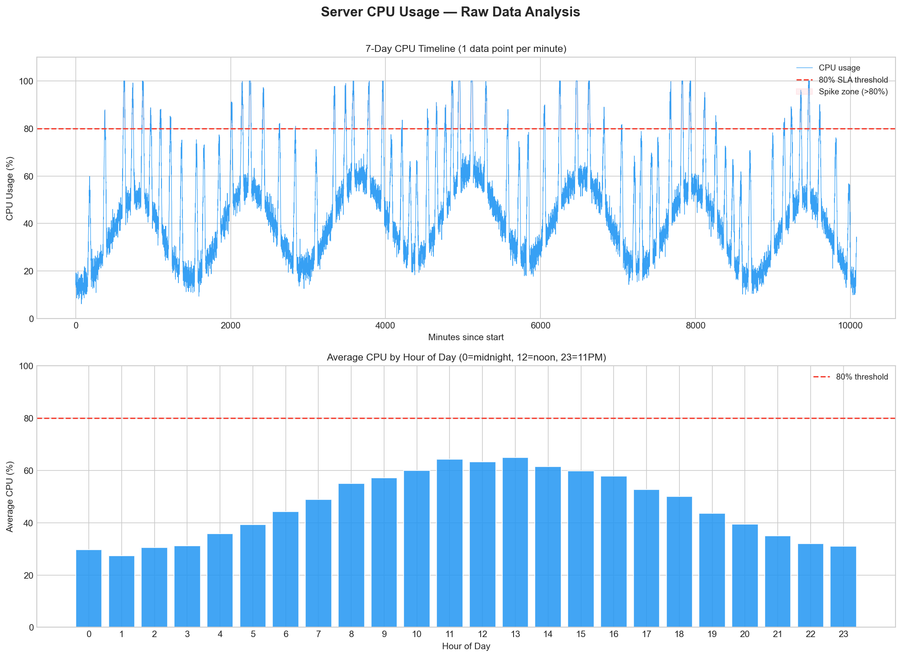
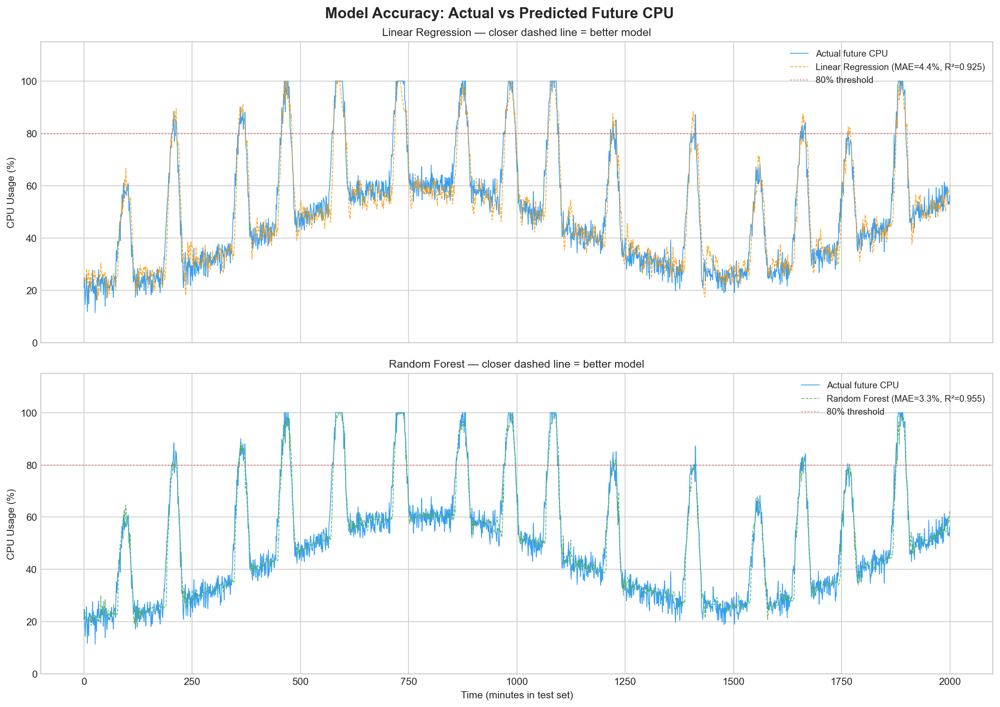
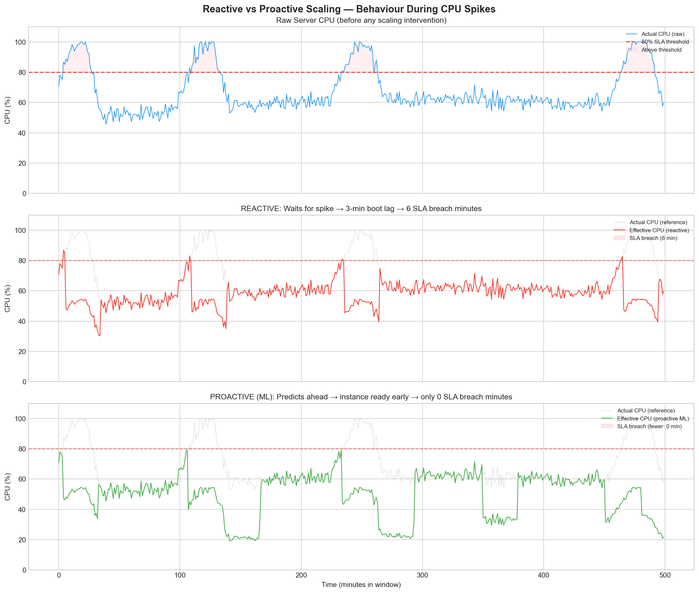
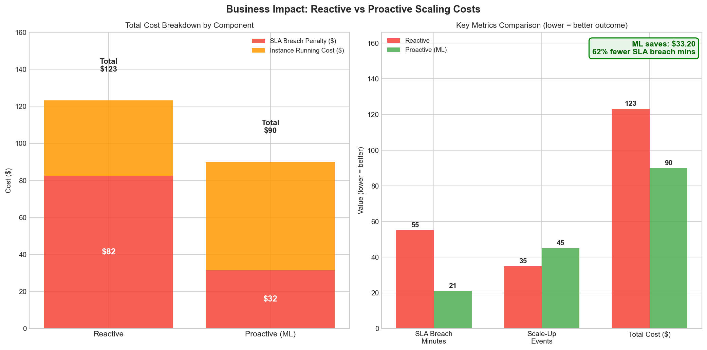
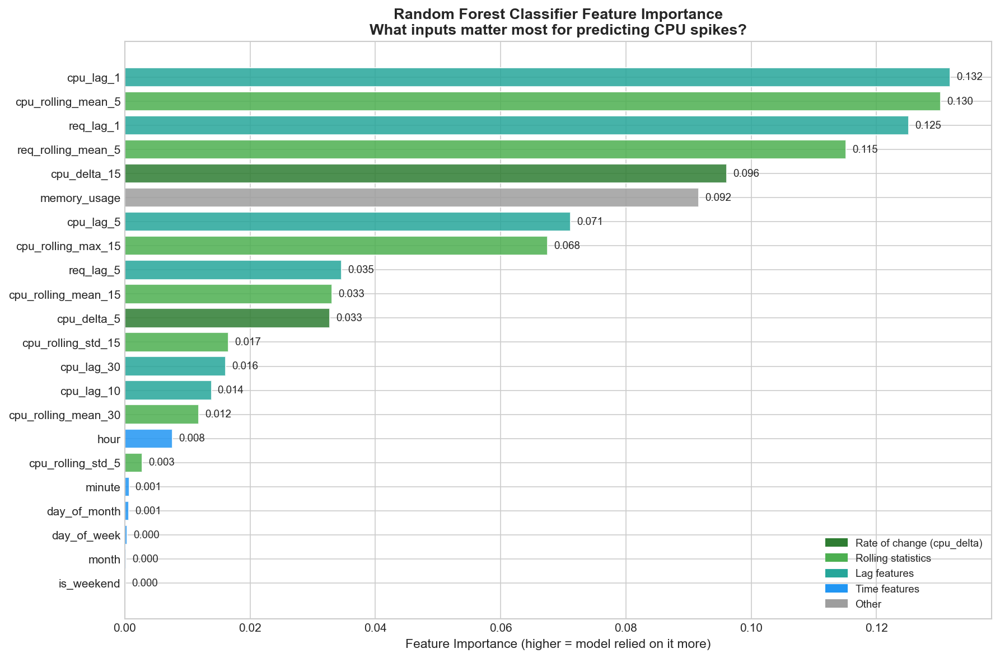

# Predictive Resource Scaler

> ML-powered server autoscaling that **predicts CPU spikes 5 minutes ahead** and pre-boots capacity before traffic hits — eliminating the 3-minute boot-lag penalty that reactive autoscaling always suffers.

---

## The Problem With Traditional Autoscaling

Every cloud autoscaler in production today is **reactive** — it waits until CPU crosses a danger threshold, *then* boots a new instance. The problem: cloud instances take 2–4 minutes to boot. During that window, existing servers are overloaded, user requests slow down or fail, and SLA penalties accumulate. The autoscaler is solving yesterday's problem.

This project replaces the reactive trigger with a **Random Forest classifier** that predicts an incoming spike 5 minutes in advance. The new instance is already running by the time the spike arrives.

---

## Results

### Simulation Over 100 Hours of Server Traffic

| | Reactive (baseline) | Proactive (ML) | Improvement |
|---|---|---|---|
| SLA Breach Minutes | 55 | 21 | **62% reduction** |
| SLA Breach Cost | $82.50 | $31.50 | **$51.00 saved** |
| Instance Running Cost | $40.60 | $58.40 | +$17.80 (expected — more pre-emptive boots) |
| **Total Cost** | **$123.10** | **$89.90** | **$33.20 net saved** |

### Model Performance

| Model | MAE | R² |
|---|---|---|
| Linear Regression (baseline) | 4.42% | 0.925 |
| Random Forest (main model) | **3.27%** | **0.955** |

**Classifier (spike prediction):** 81.9% precision · 95.2% recall · F1 = 0.880 · threshold = 0.70

---

## How It Works

```
generate_data.py → data_prep.py → train_models.py → simulate.py → visualize.py
```

```bash
python main.py   # runs entire pipeline
```

### Step 1 — `generate_data.py` · Synthetic Server Data

Generates 90 days of per-minute server metrics (CPU, requests, memory). The key design decision: **CPU spikes are modelled as 3-phase events** rather than instant jumps.

```
Phase 1 — Ramp-up   (20 min): CPU gradually climbs toward peak
Phase 2 — Sustain   (10 min): CPU holds at peak
Phase 3 — Ramp-down (15 min): CPU returns to normal
```

This mirrors how real traffic spikes behave (a marketing campaign or viral post causes gradual load buildup, not a cliff), and is what makes 5-minute-ahead prediction a genuinely solvable problem — there has to be a real precursor pattern for the model to learn from.

Daily traffic follows a realistic sine wave peaking at **1 PM** (midday business hours), with a weekly component making weekdays busier than weekends.

### Step 2 — `data_prep.py` · Feature Engineering

Engineers **22 features** across four categories. Deliberately **excludes raw `cpu_usage`** (the current-minute reading) to prevent data leakage — explained below.

| Category | Features | Why |
|---|---|---|
| **Lag** | `cpu_lag_1/5/10/30`, `req_lag_1/5` | Rear-view mirror — what was CPU doing 1, 5, 10, 30 min ago |
| **Rolling stats** | Mean/std/max over 5, 15, 30-min windows | Smoothed trend, volatility, recent worst-case |
| **Rate of change** | `cpu_delta_5`, `cpu_delta_15` | How fast CPU is climbing right now |
| **Time** | `hour`, `day_of_week`, `is_weekend`, etc. | Captures business-hours and weekday patterns |

**Target:** `spike_in_5min` — will CPU exceed 80% in the next 5 minutes? (binary: 0 or 1)

Train/test split is **chronological** (first 80% of days = train, last 20% = test), not random — shuffling time-series data would let the model train on rows that sit chronologically after test rows, which is cheating.

### Step 3 — `train_models.py` · Model Training

Trains and benchmarks two models, then runs a **decision threshold sweep** on the classifier.

**Why not just use Linear Regression?**
LR assumes a linear relationship — it can't model non-linear combinations like "CPU is rising fast *and* it's 2 PM *and* request count is spiking." Random Forest captures these interactions via an ensemble of 100 decision trees. The MAE improvement (4.42% → 3.27%) and R² improvement (0.925 → 0.955) confirm the non-linearity matters here.

**Threshold sweep (0.25 → 0.75):**
The classifier outputs a probability, not a binary yes/no. The default 0.5 cutoff is arbitrary. Missing a spike costs $1.50/min in SLA penalties; a false alarm costs ~$0.04/min in unnecessary instance runtime. F1-maximizing sweep selected **threshold = 0.70**, yielding 81.9% precision and 95.2% recall — high recall ensures the vast majority of real spikes are caught.

**Class imbalance:** Only ~8% of minutes are spike minutes. `class_weight='balanced'` prevents the model from taking the lazy shortcut of always predicting "no spike" (which would give 92% accuracy but zero utility).

### Step 4 — `simulate.py` · Business Impact Simulation

Minute-by-minute simulation of two autoscaling strategies on **identical traffic data**.

```python
class ReactiveScaler(ScalingSimulator):
    def step(self, raw_cpu, spike_proba):
        if raw_cpu > 80:          # triggers AFTER spike already happening
            self._try_spin_up()

class ProactiveScaler(ScalingSimulator):
    def step(self, raw_cpu, spike_proba):
        if spike_proba >= 0.35:   # triggers on ML prediction, 5 min ahead
            self._try_spin_up()
```

Both inherit shared logic (cost tracking, SLA detection, 3-minute boot queue) from `ScalingSimulator` and only override the trigger decision. The boot queue enforces the 3-minute delay realistically — the instance doesn't appear instantly when triggered.

**Scale-down guard:** The proactive scaler won't scale back down while the model still predicts a spike (`spike_proba < 0.30`). Without this, it would correctly pre-boot, then panic-retreat before the spike peaked — defeating the entire point.

### Step 5 — `visualize.py` · Charts

Generates 5 publication-quality charts to `charts/`. The window-selection algorithm for Chart 3 specifically searches for a 500-minute slice where the proactive/reactive timing difference is most visible — showing the exact mechanism (proactive instance ready before spike, reactive instance arriving 3 minutes late).

---

## Charts

### Raw Data — Realistic Daily & Weekly Patterns


### Model Accuracy — Random Forest Tracks Spikes, LR Misses Them


### The Core Result — Proactive ML Eliminates SLA Breaches Reactive Scaling Misses

*Reactive: 6 breach minutes in this window. Proactive: 0.*

### Business Impact — $33.20 Net Savings Over 100 Hours


### Feature Importance — Model Learns Trend, Not Just Current Value

*Top features are lag values, rolling means, and rate-of-change — not raw current CPU.*

---

## Why Excluding `cpu_usage` Matters

The most important design decision in this project is what was **not** included as a feature.

Raw current-minute CPU usage (`cpu_usage`) is highly correlated with CPU 5 minutes from now just by autocorrelation. Including it would let the model "predict" by copying the present value instead of learning real warning patterns. A model trained this way would show artificially inflated accuracy metrics but provide zero advance warning — it would only "know" a spike is coming at the exact moment the spike is already happening.

By excluding it and relying only on **historical information** (lags, rolling stats, deltas), the model is forced to genuinely learn the ramp-up pattern:

```
cpu_lag_30=42% → cpu_lag_10=55% → cpu_lag_5=65% → cpu_lag_1=74% → cpu_delta_15=+18
→ model predicts: spike in 5 minutes → proactive boot triggered
→ instance ready in 3 minutes → spike absorbed
```

The feature importance chart confirms this worked: no single feature dominates. Importance is distributed across `cpu_lag_1` (13.2%), `cpu_rolling_mean_5` (13.0%), `req_lag_1` (12.5%), `req_rolling_mean_5` (11.5%), `cpu_delta_15` (9.6%) — a healthy spread indicating genuine multi-feature pattern learning.

---

## Tech Stack

| | |
|---|---|
| **Language** | Python 3.x |
| **ML** | scikit-learn (RandomForestClassifier, RandomForestRegressor, LinearRegression) |
| **Data** | pandas, NumPy |
| **Visualisation** | Matplotlib |

---

## Project Structure

```
predictive-resource-scaler/
├── generate_data.py        # Synthetic data generation (3-phase spike model)
├── data_prep.py            # Feature engineering (lag, rolling, delta features)
├── train_models.py         # Model training + threshold sweep
├── simulate.py             # Reactive vs proactive cost simulation
├── visualize.py            # Chart generation (5 charts)
├── main.py                 # Full pipeline runner
├── requirements.txt
├── data/                   # Generated CSVs        (gitignored — run main.py)
├── models/                 # Trained .pkl files    (gitignored — run main.py)
└── charts/                 # Output PNG charts     (gitignored — run main.py)
```

---

## Setup & Run

```bash
# Clone
git clone https://github.com/devsharma30/predictive-resource-scaler
cd predictive-resource-scaler

# Create virtual environment
python -m venv venv
venv\Scripts\activate        # Windows
source venv/bin/activate     # Mac/Linux

# Install dependencies
pip install -r requirements.txt

# Run full pipeline (~2-3 min)
python main.py
```

All output files (`data/`, `models/`, `charts/`) are generated automatically.

---

## What I'd Improve With More Time

- **Real data:** Replace synthetic data with public cluster traces (Google or Azure publish these) to validate the approach on actual production traffic patterns.
- **Walk-forward validation:** Replace the single chronological split with multiple rolling train/test windows — more honest evaluation for time-series.
- **Gradient boosting:** Benchmark XGBoost or LightGBM against Random Forest on this feature set — gradient boosting typically outperforms RF on structured tabular data.
- **Online learning:** Update the model incrementally as new traffic data arrives rather than retraining from scratch.